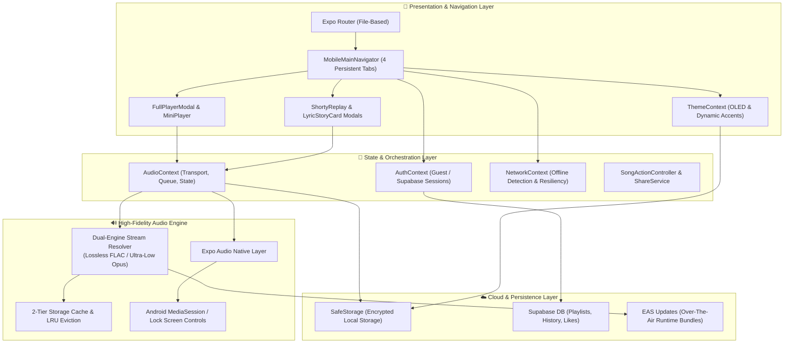

<div align="center">

# 🎵 Shorty Music

### *The Audiophile-Grade, Fluid Mobile Music Experience*

[](https://expo.dev)
[](https://reactnative.dev)
[](https://www.typescriptlang.org)
[](https://supabase.com)
[](https://github.com/satya1541/application)

<p align="center">
  A high-performance streaming music player engineered with Expo New Architecture, React 19, and native audio pipelines. Built for pure fluidity, true pitch-black OLED displays, and audiophile-grade fidelity.
</p>

---

</div>

## 🌟 Key Highlights

- 🎧 **Dual-Engine High-Fidelity Audio**: Instant stream resolution supporting bit-perfect **Lossless FLAC** and ultra-low latency **Opus** audio streams.
- 🎨 **Pure OLED & Dynamic Accent Engine**: True pitch-black `#000000` AMOLED dark mode with instant palette shifts (*Spotify Neon*, *Apple Crimson*, *Cyberpunk Purple*, *Electric Cyan*, *Champagne Gold*).
- 🏆 **Shorty Replay (Monthly Wrapped)**: Authentic brutalist full-screen story engine with segmented progress bars, top artist spotlights, listening personas, and shareable 9:16 social posters.
- 💬 **Time-Synced Lyrics & Story Cards**: Real-time karaoke typography with auto-scroll and an Apple Music-style 4:5 **Lyric Quote Card** social generator.
- 🔗 **Smart Playlist & Library Sync**: Cloud-backed user playlists with Supabase, one-tap native OS sharing, and offline song persistence.
- ⚡ **Zero-Latency In-Memory Architecture**: Intelligent multi-token search, 2-tier disk/RAM cache with LRU eviction, and sub-100ms UI transitions.

---

## 🏛️ System Architecture



---

## 🚀 Feature Showcase

### 1. 🎛️ Dynamic OLED & Accent Personalization
- **True Pitch-Black (`#000000`) OLED Mode**: Pixels shut off completely on AMOLED displays to drastically reduce power consumption.
- **Colorway Engine**: Switch seamlessly across **Pure OLED**, **Midnight Navy** (`#080C14`), and **Classic Slate** (`#121212`).
- **Global Accent Propagation**: Change your accent color in Settings and watch bottom tabs, active tracks, equalizer animations, progress sliders, and action buttons shift instantaneously with zero layout reload.

### 2. 🎵 Adaptive Full Player & Living Aurora
- **3D Deck Carousel**: Interactive 3D carousel that tracks your upcoming playback queue.
- **Living Aurora Background**: Dynamic mesh gradient that samples the current album art palette and animates glowing color orbs in real time.
- **Continuous Video Canvas**: Embedded background canvas video playback synchronized directly with track timestamps.

### 3. 💬 Interactive Lyrics & Apple Music-Style Story Cards
- **Real-Time Synchronized Lyrics**: Millisecond-accurate lyric highlighting with smooth auto-scroll and one-tap line seeking.
- **Quote Mode**: Tap *Share Quote* or long-press any lyric line to select 1 to 4 favorite verses.
- **Social Story Card Generator**: Produces an authentic 4:5 typography card featuring album artwork, track title, artist attribution, and custom quotes ready to share across Instagram, WhatsApp, and Twitter.

### 4. 🏆 Shorty Replay (Automated Monthly Wrapped)
- **30-Day Automated Presentation**: Automatically checks listening thresholds on app open once every 30 days.
- **Segmented Instagram Story Architecture**: 7 brutalist, typography-dense slides:
  - *Slide 0*: The Drop (Geometric optical explosions)
  - *Slide 1*: Total Minutes Streamed (Repeating neon stacked type)
  - *Slide 2*: Top Genres Breakdown
  - *Slide 3*: Top Artist Spotlight (Sombr-style polaroid with worldwide fan badge)
  - *Slide 4*: Most Looped Tracks
  - *Slide 5*: Listening Persona & Aura Archetype
  - *Slide 6*: Master 9:16 Shareable Poster Card

### 5. 🔍 Multi-Token Search & Discoverability
- **Intent-Aware Search Orchestrator**: Instant classification of user queries across songs, artists, albums, and curated charts.
- **Typo-Tolerant Engine**: Auto-corrects misspelled track and artist names on the fly.
- **Tilted Disc Showcase**: Spotify-inspired category cards with rotating vinyl disk artwork.

### 6. 📱 Background Audio & Lock Screen Controls
- **Android MediaSession**: Full metadata, album artwork, scrubber progress, and previous/next transport controls directly on the system lock screen and notification shade.
- **Media Output Routing**: One-tap transition to system media switchers and Bluetooth peripherals.

---

## 🛠️ Technology Stack

| Component | Technology | Description |
|---|---|---|
| **Framework** | [Expo SDK 57](https://expo.dev) | New Architecture, React Native 0.86, React 19 |
| **Routing** | [Expo Router v57](https://docs.expo.dev/router/introduction/) | Typed file-based routing and deep-linking |
| **Language** | [TypeScript 6](https://www.typescriptlang.org/) | Strict static typing and compile-time safety |
| **Audio Core** | `expo-audio` | Native background audio, buffering & lockscreen controls |
| **Graphics & Blur** | `expo-linear-gradient`, `expo-blur` | GPU-accelerated mesh gradients and frosted glass |
| **Image Pipeline** | `expo-image` | High-performance memory-disk cached image pipeline |
| **State & Cache** | Context API + `SafeStorage` | Persistent local key-value storage with fallback isolation |
| **Cloud Sync** | [Supabase](https://supabase.com/) | Real-time auth, row-level security & database sync |
| **Deployment** | [EAS Update](https://docs.expo.dev/eas-update/introduction/) | Instant Over-The-Air (OTA) runtime updates |

---

## 📂 Project Structure

```
APPLICATION/
├── src/
│   ├── app/                      # Expo Router navigation routes & layouts
│   │   ├── _layout.tsx           # Global providers (Theme, Audio, Auth, Network)
│   │   └── index.tsx             # Root auth gate & initial route
│   ├── components/
│   │   ├── common/               # SongItemRow, SourceBadge, SkeletonLoader, OfflineBanner
│   │   ├── feed/                 # GreetingHeader, MediaCarousel, QuickAccessGrid
│   │   ├── mobile/               # MobileHomeScreen, MobileSearchScreen, MyLibScreen, SettingsScreen
│   │   ├── player/               # FullPlayerModal, MiniPlayer, LyricsView, LyricStoryCardModal
│   │   └── profile/              # ShortyReplayModal, MonthlyReplayController, UserPlaylistModal
│   ├── contexts/                 # AudioContext, ThemeContext, AuthContext, NetworkContext
│   ├── services/                 # Stream resolvers, cache management, analytics, cloud sync
│   └── types/                    # Music, explore, and recommendation TypeScript interfaces
├── assets/                       # Icons, splash screens, vector typography
├── supabase/                     # Database migrations & RLS policies
├── app.json                      # Expo application manifest & EAS configuration
└── eas.json                      # EAS Build & OTA Update channels
```

---

## ⚡ Quick Start Guide

### Prerequisites
- Node.js (v18 or higher)
- npm or yarn
- Android Studio / Physical Android Device (Android 8.0+)

### 1. Clone & Install
```bash
git clone https://github.com/satya1541/application.git
cd application
npm install
```

### 2. Configure Environment Variables
Copy `.env.example` to `.env` and fill in your Supabase credentials:
```bash
cp .env.example .env
```
```env
EXPO_PUBLIC_SUPABASE_URL=your_supabase_url
EXPO_PUBLIC_SUPABASE_ANON_KEY=your_supabase_anon_key
EXPO_PUBLIC_GOOGLE_CLIENT_ID=your_google_client_id
```

### 3. Run Locally
```bash
# Start Metro bundler
npx expo start

# Run directly on an Android device or emulator
npx expo run:android
```

### 4. Build & Over-The-Air (OTA) Deployments
```bash
# Build standalone Preview APK
npx eas-cli build --platform android --profile preview

# Deploy an instant OTA update (without rebuilding the APK)
npx eas update --channel preview --platform android --environment preview --message "Your release message"
```

---

## 🔒 Security & Privacy

- **Protected Secrets**: Sensitive keys and service configuration are strictly isolated from client-side bundles and Git tracking.
- **Guest-First Design**: Users can immediately stream and curate playlists offline without mandatory registration.
- **Row-Level Security**: Supabase policies restrict user data access strictly to authenticated account holders.

---

## 📄 License

This project is licensed under the MIT License — see the [LICENSE](LICENSE) file for details.

<div align="center">
  <sub>Crafted with passion for music lovers and audiophiles worldwide.</sub>
</div>
